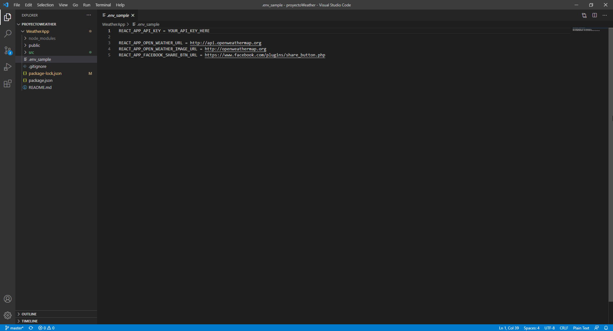

# WeatherApp

WeatherApp is a SPA ment to provide users a way to access climatological inforamtion of specific geographich locations. 


## Requirements for running the project:

  * [Visual Studio Code](https://code.visualstudio.com)
  * [Node Package Manager](https://nodejs.org)
  * [Open Weather API key](https://openweathermap.org/)
  * [GIT](https://git-scm.com/) (recommended) -> with git is easier to clone repositories once you learned how to use it , if you don't want to use this tool you       can download the repository in zip format .

    -For Ubuntu run the following commands in the terminal:
    
    ```bash
      1- sudo apt update
      2- sudo apt install git
      3- git --version (if installed correctly it should display the current git version)
      ```

    -For [Windows](https://git-scm.com/download/win)
    
      1- select the version corresponding to your OS and download the installer.
      
      2- once downloaded run the installer.
      
      3- Open the command prompt and type git --version (if correctly installed it should display the current git version).
      
## Setup:

After downloading all the required resources and generating your own API key you will need to set this on the .env file.<br />
This repository contains a sample .env file called ".env_sample".<br /> 
Here you should replace the variable value corresponding to the API key with your own in order for the app to work.<br />


      
      
This project was bootstrapped with [Create React App](https://github.com/facebook/create-react-app).

## Available Scripts

In the project directory, you can run:

### `npm start`

Runs the app in the development mode.<br />
Open [http://localhost:3000](http://localhost:3000) to view it in the browser.

The page will reload if you make edits.<br />
You will also see any lint errors in the console.

### `npm test`

Launches the test runner in the interactive watch mode.<br />
See the section about [running tests](https://facebook.github.io/create-react-app/docs/running-tests) for more information.

### `npm run build`

Builds the app for production to the `build` folder.<br />
It correctly bundles React in production mode and optimizes the build for the best performance.

The build is minified and the filenames include the hashes.<br />
Your app is ready to be deployed!

See the section about [deployment](https://facebook.github.io/create-react-app/docs/deployment) for more information.

### `npm run eject`

**Note: this is a one-way operation. Once you `eject`, you can’t go back!**

If you aren’t satisfied with the build tool and configuration choices, you can `eject` at any time. This command will remove the single build dependency from your project.

Instead, it will copy all the configuration files and the transitive dependencies (webpack, Babel, ESLint, etc) right into your project so you have full control over them. All of the commands except `eject` will still work, but they will point to the copied scripts so you can tweak them. At this point you’re on your own.

You don’t have to ever use `eject`. The curated feature set is suitable for small and middle deployments, and you shouldn’t feel obligated to use this feature. However we understand that this tool wouldn’t be useful if you couldn’t customize it when you are ready for it.


## Change and future improvements:

This project is still under develop and modifications need to be done

### More Urgent:

- Fix My Favorites bug (currentnly not being able to add one fav).
- Add search functionality in My Favorites.

### To improve or fix:

- Improve unit tests (check API response and give feedback to the user, test localStorage behavior).
- Give the user the option to choose the desired weather metric.
- Review for typeO's, hardcoded and repeated code.
- Image size.
- Give pr's a more meanningfull name and description of what is does.
- Lock libraries version once the project is ready for deploy.

### In the future:

- Build and deploy to GitHub Pages.
- Show project test coverage.

